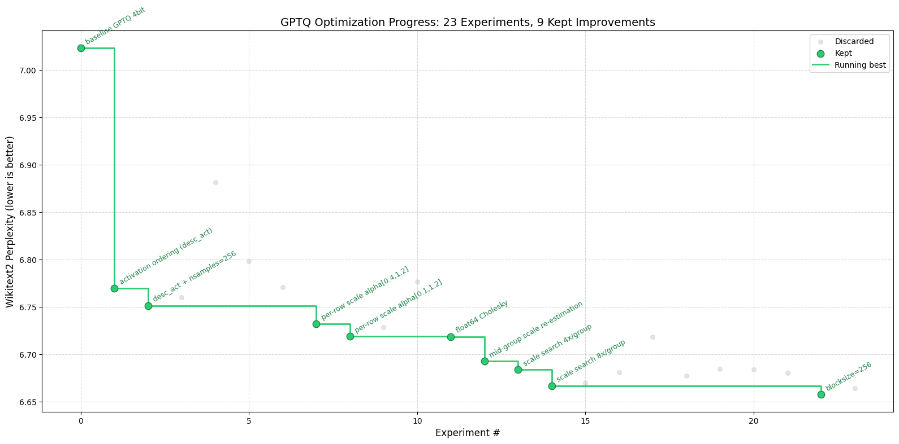

# AutoQuant

inspired by [autoresearch](https://github.com/karpathy/autoresearch) by Andrej Karpathy.

The idea: give an AI agent a post-training quantization setup and let it experiment autonomously overnight. It modifies the code, quantizes the model, checks if the result improved, keeps or discards, and repeats.

## How it works

The repo is deliberately kept small and only really has five files that matter:
- **quantize.py** — the quantization script with the algorithm
- **quantizer.py** — the quantizer class
- **data_utils.py** — data preparation utilities
- **eval_perplexity.py** — perplexity evaluation script
- **program.md** — the experiment description